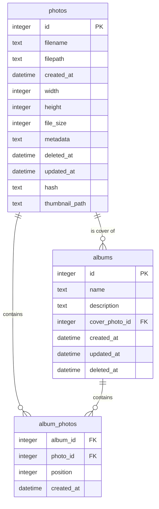

# SpinningMomo 数据库设计文档

## 数据库概述

SpinningMomo项目使用SQLite3作为数据库管理系统。SQLite3是一个轻量级的、嵌入式的关系型数据库，非常适合桌面应用程序使用。

## 数据库表结构

### 1. photos（照片表）
存储照片的基本信息。

```sql
CREATE TABLE photos (
    id INTEGER PRIMARY KEY,
    filename TEXT NOT NULL,           -- 文件名
    filepath TEXT NOT NULL,           -- 文件路径
    created_at DATETIME NOT NULL,     -- 创建时间
    width INTEGER NOT NULL,           -- 图片宽度
    height INTEGER NOT NULL,          -- 图片高度
    file_size INTEGER NOT NULL,       -- 文件大小(bytes)
    metadata TEXT,                    -- 元数据(JSON格式)
    deleted_at DATETIME,              -- 软删除时间
    updated_at DATETIME NOT NULL,     -- 更新时间
    hash TEXT,                        -- 文件哈希值
    thumbnail_path TEXT               -- 缩略图路径
);

-- 索引
CREATE INDEX idx_photos_created_at ON photos(created_at);
CREATE INDEX idx_photos_deleted_at ON photos(deleted_at);
CREATE INDEX idx_photos_hash ON photos(hash);
```

### 2. albums（相册表）
存储相册信息。

```sql
CREATE TABLE albums (
    id INTEGER PRIMARY KEY,
    name TEXT NOT NULL,               -- 相册名称
    description TEXT,                 -- 相册描述
    cover_photo_id INTEGER,          -- 封面照片ID
    created_at DATETIME NOT NULL,     -- 创建时间
    updated_at DATETIME NOT NULL,     -- 更新时间
    deleted_at DATETIME,             -- 软删除时间
    FOREIGN KEY (cover_photo_id) REFERENCES photos(id)
);

-- 索引
CREATE INDEX idx_albums_created_at ON albums(created_at);
CREATE INDEX idx_albums_deleted_at ON albums(deleted_at);
```

### 3. album_photos（相册照片关联表）
管理相册和照片的多对多关系。

```sql
CREATE TABLE album_photos (
    album_id INTEGER NOT NULL,
    photo_id INTEGER NOT NULL,
    position INTEGER NOT NULL,        -- 照片在相册中的位置
    created_at DATETIME NOT NULL,     -- 创建时间
    FOREIGN KEY (album_id) REFERENCES albums(id) ON DELETE CASCADE,
    FOREIGN KEY (photo_id) REFERENCES photos(id) ON DELETE CASCADE,
    PRIMARY KEY (album_id, photo_id)
);

-- 索引
CREATE INDEX idx_album_photos_album_id ON album_photos(album_id);
CREATE INDEX idx_album_photos_photo_id ON album_photos(photo_id);
CREATE INDEX idx_album_photos_position ON album_photos(position);
```

## 数据库关系图



## 数据库迁移

### 迁移文件位置
```
backend/database/migrations/
├── 001_initial_schema.sql
├── 002_add_indexes.sql
└── 003_add_thumbnails.sql
```

### 迁移命令
```bash
# 创建新的迁移文件
./tools/create_migration.sh "migration_name"

# 应用迁移
./tools/migrate.sh

# 回滚最后一次迁移
./tools/rollback.sh
```

## 数据库维护

### 1. 备份策略
- 自动备份：每天凌晨3点
- 备份位置：`./backup/`
- 保留时间：最近7天

### 2. 性能优化
1. 索引优化
   - 已创建常用查询字段的索引
   - 避免过度索引
   
2. 查询优化
   - 使用预编译语句
   - 合理使用事务
   - 分页查询限制

### 3. 数据完整性
1. 外键约束
   - 使用ON DELETE CASCADE确保关联数据的一致性
   
2. 唯一约束
   - 文件哈希值用于去重

## 注意事项

1. **事务处理**
   - 涉及多表操作时使用事务
   - 批量操作时使用事务提升性能

2. **并发处理**
   - 使用事务确保数据一致性
   - 实现乐观锁避免并发冲突

3. **数据迁移**
   - 严格遵循迁移版本控制
   - 保持迁移脚本的幂等性

4. **性能监控**
   - 定期检查索引使用情况
   - 监控查询性能
   - 及时优化慢查询

## 常见问题

### 1. 数据库锁定
Q: 数据库出现锁定怎么办？
A: 检查是否有长时间运行的事务，可以使用 `PRAGMA busy_timeout` 设置超时时间。

### 2. 性能问题
Q: 查询性能下降怎么处理？
A: 
1. 检查索引使用情况
2. 优化查询语句
3. 使用EXPLAIN分析查询计划

### 3. 数据一致性
Q: 如何确保数据一致性？
A: 
1. 使用事务进行操作
2. 定期进行数据完整性检查
3. 实现定期备份策略 