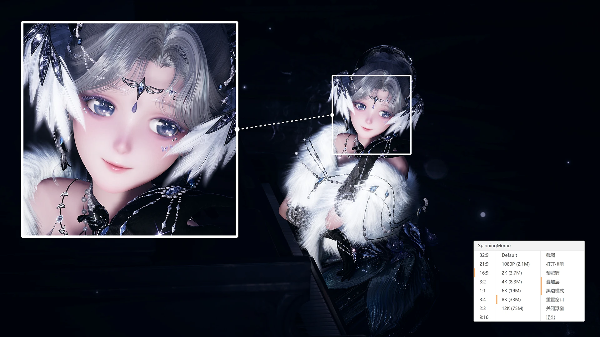

  <h1>
    
     
    🎮 旋转吧大喵
      
    一个为 《无限暖暖》 提升摄影体验的窗口调整工具
     

  </h1>

  

    
    
    
  

  

    <b>
      <a href="https://chaniok.github.io/SpinningMomo">📖 使用文档</a> •
      <a href="https://chaniok.github.io/SpinningMomo/dev/build-guide">🛠️ 构建指南</a> •
      <a href="https://chaniok.github.io/SpinningMomo/en/">🌐 English</a>
    </b>
  

  

## 🎯 项目简介

旋转吧大喵（SpinningMomo）

▸ 一键切换游戏窗口比例/尺寸，完美适配竖构图拍摄、相册浏览等场景

▸ 突破原生限制，支持生成 8K-12K 超高清游戏截图和录制

▸ 专为《无限暖暖》优化，同时兼容多数窗口化运行的其他游戏

> 🚧 v2.0 正在翻工中，部分功能尚未就绪。
> 如需稳定版，请下载 [v0.7.7 旧版本](https://github.com/ChanIok/SpinningMomo/releases/tag/v0.7.7)。

### 📥 下载地址

- **GitHub Release**：[点击下载最新版本](https://github.com/ChanIok/SpinningMomo/releases/latest)
- **蓝奏云**：[点击下载](https://wwf.lanzoul.com/b0sxagp0d)（密码：momo）
- **百度网盘**：[点击下载](https://pan.baidu.com/s/1UL9EJa2ogSZ4DcnGa2XcRQ?pwd=momo)（提取码：momo）

### 📖 使用指南

 查看 [使用文档](https://chaniok.github.io/SpinningMomo) 了解更多详细信息。

### 🛠️ 构建指南

查看 [构建指南](https://chaniok.github.io/SpinningMomo/dev/build-guide) 了解环境要求和构建步骤。

## 🗺️ 开发状态

✅ **已完成**：录制功能

🔨 **进行中**：即时回放、动态照片、虚拟手柄、相册功能、HDR支持

## 📄 开源协议

本项目采用 [MIT 协议](LICENSE) 开源。项目图标来自游戏《无限暖暖》，版权归游戏开发商所有。