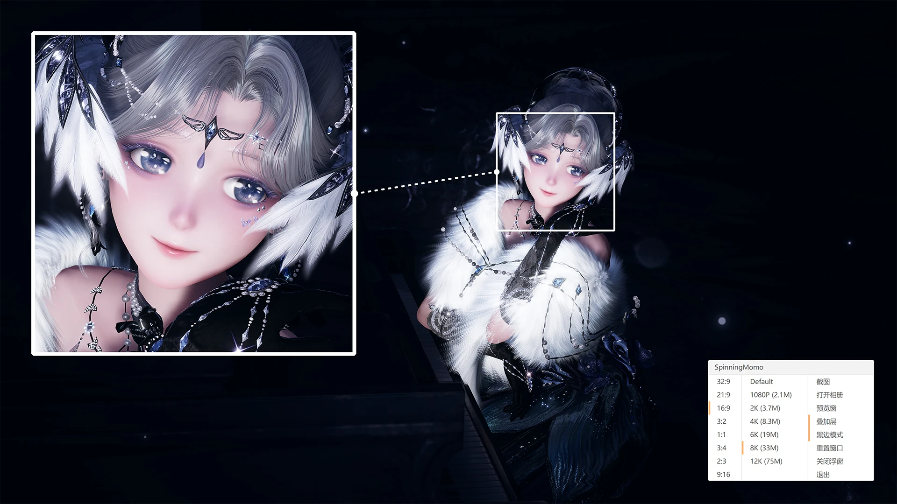

[English](README_EN.md) | [简体中文](README.md)

  <h1>
    
     
    旋转吧大喵
      
    《无限暖暖》游戏摄影与录像工具
     

  </h1>

  

    
    
    
  

  

## 简介

旋转吧大喵（SpinningMomo）

▸ 一键切换游戏窗口比例/尺寸，完美适配竖构图拍摄、相册浏览等场景

▸ 突破原生限制，支持生成 8K-12K 超高清游戏截图和录制

▸ 内置游戏摄影图库，自动索引照片与视频，支持标签、评分、时间线、颜色筛选和批量整理

▸ 专为《无限暖暖》优化，同时兼容多数窗口化运行的其他游戏

### 下载地址

- **GitHub Release**：[点击下载最新版本](https://github.com/ChanIok/SpinningMomo/releases/latest)
- **百度网盘**：[点击下载](https://pan.baidu.com/s/1UL9EJa2ogSZ4DcnGa2XcRQ?pwd=momo)（提取码：momo）

### 使用指南

 查看 [使用文档](https://spin.infinitymomo.com) 了解更多详细信息。

### 构建指南

查看 [构建指南](https://spin.infinitymomo.com/developer/architecture) 了解环境要求和构建步骤。

## 致谢

感谢 [SignPath.io](https://signpath.io) 提供免费代码签名服务，证书由 [SignPath Foundation](https://signpath.org) 提供。 
&emsp;Committer & approver: [ChanIok](https://github.com/ChanIok)

感谢 [NUAN5.PRO](https://NUAN5.PRO) 提供照片数据解析服务支持。

本项目使用的第三方开源项目及其许可信息请见 [CREDITS.md](CREDITS.md)。

## 声明

本项目采用 [GPL 3.0 协议](LICENSE) 开源。

使用前请阅读 [法律与隐私说明](https://spin.infinitymomo.com/about/legal)。
